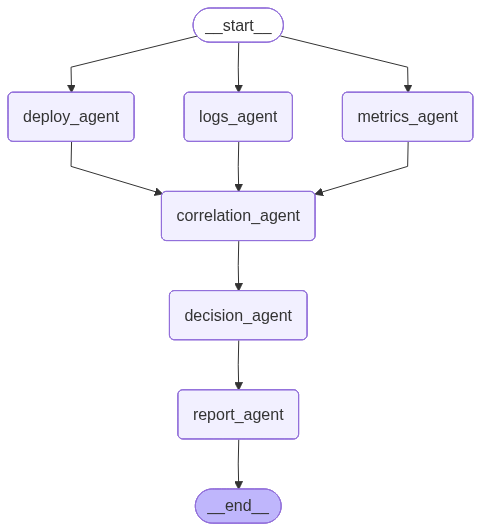

# Incident AI - Hackathon Winning Solution

An intelligent incident response system that automatically investigates, correlates, and resolves production incidents using multi-agent architecture.

## Architecture

### LangGraph Workflow



*To regenerate this diagram, run: `python generate_graph_image.py`*

### High-Level Flow

```
User / Alert Trigger
        ↓
   FastAPI Backend
        ↓
 Commander Agent (Brain)
        ↓
 ┌───────────────┬───────────────┬────────────────┐
 ↓               ↓               ↓
Metrics Agent   Logs Agent   Deploy Agent
 ↓               ↓               ↓
 └──────────→ Correlation Engine ←──────────┘
                      ↓
               Decision Engine
                      ↓
             Action + RCA Report
```

## Features

- **Multi-Agent System**: Specialized agents for metrics, logs, and deployments
- **Intelligent Correlation**: Correlates signals across different data sources
- **Automated Decision Making**: Provides root cause analysis and recommended actions
- **Confidence Scoring**: Includes confidence levels for decisions
- **Timeline Analysis**: Generates incident timelines
- **FastAPI Backend**: RESTful API for incident handling

## Installation

1. Create virtual environment:
   ```bash
   python -m venv venv
   ```

2. Activate environment:
   ```bash
   # Windows
   venv\Scripts\activate
   ```

3. Install dependencies:
   ```bash
   pip install fastapi uvicorn
   ```

## Usage

Run the application:
```bash
uvicorn app.main:app --reload
```

Access the incident endpoint:
```
GET http://127.0.0.1:8000/incident
```

## Demo Script

"Our system detected a latency spike from metrics agent. Logs agent identified DB timeouts. Deploy agent found a recent configuration change. We correlated all signals and identified the root cause. System automatically recommends rollback."

## Project Structure

```
incident-ai/
├── app/
│   ├── main.py
│   ├── graph.py
│   ├── agents/
│   │     ├── commander.py
│   │     ├── metrics_agent.py
│   │     ├── logs_agent.py
│   │     └── deploy_agent.py
│   ├── services/
│   │     ├── correlation.py
│   │     ├── decision.py
│   ├── data/
│   │     ├── metrics.json
│   │     ├── logs.json
│   │     └── deploy.json
│   └── utils/
│       └── report_generator.py
├── docs/
│   └── incident-analysis-workflow.png
├── generate_graph_image.py
├── venv/
├── README.md
└── .git/
```